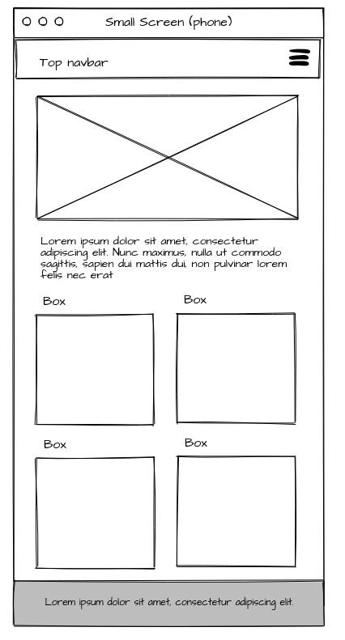
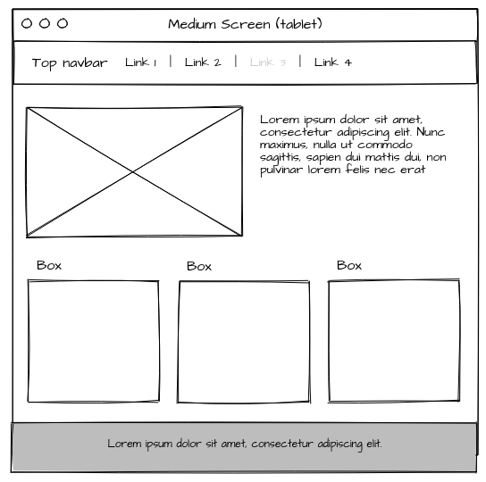
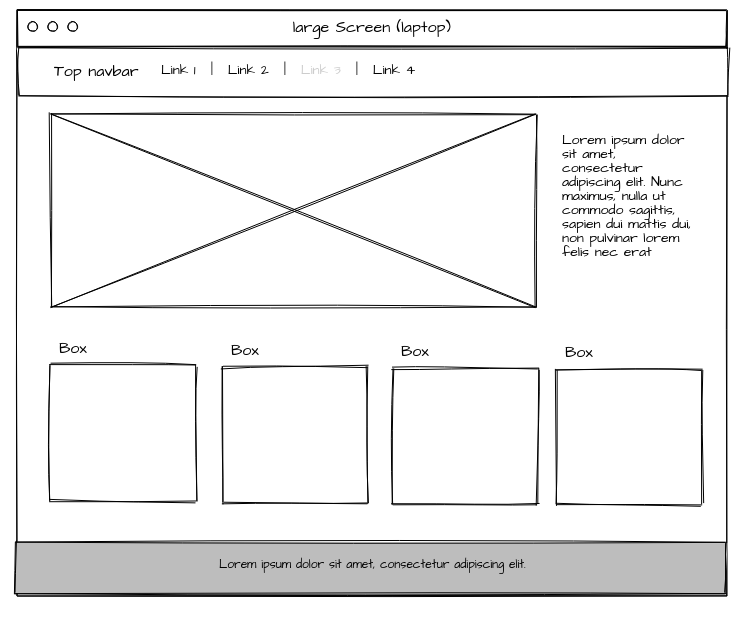
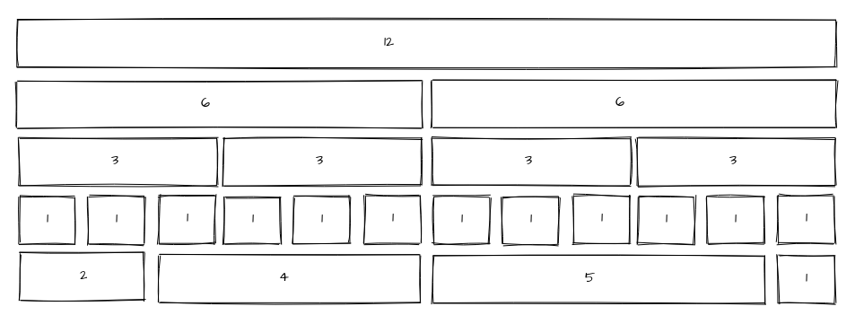
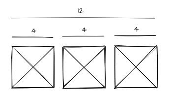
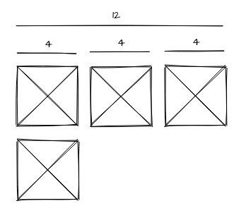

# Bootstrap Layout

In this worksheet I will be showing you how to use the Bootstraps grid to layout your web pages.


## Getting started

The first thing we need to do is download the starter code for this worksheet.

I have based this on a [starter template](https://getbootstrap.com/docs/5.1/examples/), replacing the bootstrap css and JavaScript links with cdn links for you, and including a basic html structure for a very simple page. 

To get started, dowload the starter code from blackboard ( it is just one index.html file) and open it in a text editor (I recommend Visual Studio Code)

**Save the file and take a quick look over the code.**

**Open the index.html file on your web browser and take a quick look at how the code is currently displaying.**

## Bootstrap classes

We will not add any extra HTML elements, or our own CSS for this worksheet, we will alter the layout by only adding bootstrap classes.

e.g.

If I have a div html element

```html
<div>
    
</div>
```

If I wanted to add a container class to it, we would do the following

```html
<div class="container">
    
</div>
```

<div style="page-break-after: always"></div>

## Containers

When creating a Bootstrap page, the first thing you need to think about is your container.

There are two main types of Bootstrap containers, these wrap around all the other elements.

You can turn any HTML element into a container by giving it the class of `container-fluid` or `container`


### container-fluid

Assigning the `container-fluid` class to an element will allow the contents to fill the width of the screen. You can see it being used on the div in the navBar at the top of the body element.

### container

Applying a class of just `container` creates a fixed width element. This width will change based on the window size. 

These different widths are called *Break points*, and are the foundation of how Bootstrap allows you to create responsive pages.


**- Change the width of you window (just drag the edge) to see how the page currently responds.**


**- Add a class of `container` to the `main` element.**

you should now have:

```html
  <!-- Main -->
  <main class="container">
```


**- Change the width again to see how the main element now behaves differently.**

You can read more [about containers here](https://getbootstrap.com/docs/5.1/layout/containers/)

<div style="page-break-after: always"></div>

## Breakpoints

When you give an element a class of `container` you will see that it will jump between different widths. These are call Breakpoints.

Bootstrap contains six default break points. You can utilize these breakpoints to layout your page differently depending on the width of the window ( or device).

This is the foundation of how Bootstrap helps you make a responsive website.

|Breakpoint| Class name identifier | Screen Width |
|--- |---|---|
|X-Small|  |<576px|
|Small|	sm	|≥576px|
|Medium|	md	|≥768px|
|Large| lg |≥992px|
|Extra large|	xl	|≥1200px|
|Extra extra large|	xxl	|≥1400px|

You can read [more about breakpoints here](https://getbootstrap.com/docs/5.1/layout/breakpoints/).

<div style="page-break-after: always"></div>

## Wireframes

For the page we are making I have created 3 wireframes to show the placement of all the elements on the page at different breakpoints. We will refer back to these for the rest of the work sheet.

##### Small and X-small 

 

##### Medium

 
<div style="page-break-after: always"></div>
##### Large and above

 

<div style="page-break-after: always"></div>

## Navbar

Now we know what we are trying to achieve, we can start to layout the page using Bootstrap classes. 

### NavBar

The Navbar already has lots of Bootstrap classes applied to it in the starter code:

`navbar navbar-expand-md navbar-dark bg-dark fixed-top`

You can see that you can apply multiple classes to an element by adding a space between them.

For this layout worksheet the most important ones to note are `navbar-expand-md` this will change the nav from a three line burger menu to a list of links when the screen size is medium or larger. 

**- How wide will the screen be in pixels when the nav changes?**

HINT: There -md in the class name

The second thing to note, is `fixed-top` this means that the nav bar will stick to the top of the page.

As discussed before, nested within the Navbar is `<div class="container-fluid">` making the navigation elements stretch to the full width of the window.

### Responsive images

You can see that we have an image and some text nested inside the `<header>` element.

The image is large and displays at its full size ( we are using https://picsum.photos/ to give us random images)

**- Add the class `img-fluid` to the image element in the header.**

The image should now scale to fit the the container.

If you want to know more or are unsure how to do this, [check the documentation here](https://getbootstrap.com/docs/5.1/content/images/#responsive-images).

you should now have:

```html

```


### Padding

We want to add a little more space between the text and the image,

We can do this by adding padding.

In Bootstrap this is done by adding a class `p-1` to the element, the number ranges from 1-5 to specify how large to make it.

We can also just apply padding to the top by using `pt-` or bottom `pb-` .

**- Add 3 units of padding to the top of the `<p>` element in the header.**

You can learn [more about padding and margins here](https://getbootstrap.com/docs/5.1/utilities/spacing/).

You should now have:

```html
<p class="pt-3">
	Lorem ipsum dolor sit amet, consectetur adipiscing elit. Ut maximus enim lacus, vel 	tincidunt tellus volutpat quis. Proin sagittis tellus at ullamcorper imperdiet.
</p>
```

<div style="page-break-after: always"></div>

### Rows and Columns

Our header element now matches the layout of the small wireframe.

We now want the layout to change as the window gets wider.

Look at the wireframe for medium window. It shows the image and text next to each other taking up half the screen each.

To achieve this we will use Bootstraps responsive grid. This is made up of rows and columns.

 Columns ALWAYS have to be nested within row elements.

First we will add a row.

**- Add a class of `row` to the header element.**

next, we will add columns inside the row.

**- Add a class of `col` to the 2 div's inside the header.**

If you now look back at your browser, you will see the image and text are now next to each other just like the wireframe.

BUT we have now lost the original layout that matched the small wireframe!

The great thing about Bootstrap is that we can specify different layouts for different screens.

**- Change the class on the 2 div's inside header from `col`to `col-12` and add another class called `col-md-6`.**

This should give you:

```html
<div class="col-12 col-md-6">
```

Your header should now match the layout of the small and medium wireframes.

This works by making each div 12 units wide by default. But, when the screen is medium or larger, they both shrink to 6 units wide.

You can see `md` here in the class name used to show this is a rule for medium screens and larger,  you can see the letters to use for other sizes in the breakpoint table you saw earlier.

**- But why 12 and 6?**

<div style="page-break-after: always"></div>

### 12 columns

The Bootstrap grid is 12 units across.

You can set the width of a column by adding a number to the `col` class name, you can use any number from 1-12.

e.g. `<div class="col-4">`

Different numbers make the width of the column fill up a different proportion of the whole row.

 

You can see that a `12` will fill the whole row, and a `6` will fill half the row.


### Unequal columns

All the columns in a row do not have to be the same size, you can add different numbers to different columns.

**- Look at the wireframe for the large layout.**

You will see that we want the image to be 3 times larger than the text.

**- Add another class to the 2 div's in the header so the layout matches the large layout**

HINT: Use -lg

The small and medium layouts should still work.

<div style="page-break-after: always"></div>

### More than 12 columns

Now that we have finished the header section we can move on to the Boxes section.

We have 4 div's here inside a section element. Each div contains an image and some text.

**- First add an `img-fluid` class to all 4 images.**

Then:

**- Add a `row` class to the section opening tag.**

Finally:

**- Add a `col` class to the each of the 4 div's nested in the section.**

You should now have:

```html
     <!-- Boxes section -->
    <section class="row">
      <div class="col">
        <h3>Box 1</h3>
        
      </div>
      <div class="col">
        <h3>Box 2</h3>
        
      </div>
      <div class="col">
        <h3>Box 3</h3>
        
      </div>
      <div class="col">
        <h3>Box 4</h3>
        
      </div>
    </section>
```

By default, Bootstrap will spread the boxes evenly across the container.

However, our small wireframe shows that we want to have the boxes arranged in 2 columns.

We know that in Bootstrap each row is 12 units wide. Therefore, to get 2 columns we would make each 6 wide as we did on the header.

BUT, in this case there are 4 boxes, 6 * 4 = 24 units!

**- What do you think happens if you put more than 12 units worth of columns into a row?**

If the column widths add up to more than 12, the extra columns will wrap round and appear underneath.

e.g.

I can have 3 columns, each 4 units wide and they will appear neatly next to each other ( 3 * 4 = 12) .

 

But if I add one more, it will wrap bellow ( 4 * 4 = 16)

 


**- Change the col number on the div's to match the small wireframe. i.e. 2 boxes stacked on top of 2 boxes**

HINT 1:`<div class="col-?">`

HINT 2: they should all have the same number.

<div style="page-break-after: always"></div>

### Hide Columns

We can now move onto the medium wireframe.

Sometimes we may not want to display all the content on every window size.

You can see that the small wireframe shows 4 boxes, but the medium one only shows 3.

We therefore want to hide one.

**- ONLY on the last box div, next to your col class,  add the class `d-md-none`**

**- Change the width of your window and see how the last box disappears**

You can read more out [hiding elements here](https://getbootstrap.com/docs/5.1/utilities/display/).

You will also notice that the medium wireframe shows 3 boxes in a row.

**- Add another class to the first three div's to show 3 boxes in a row when the screen is medium size**

On the first 3 box div's you should now have:

```html
 <div class="col-6 col-md-4">
```

and on the last box div, you should have:

```html
<div class="col-6 d-md-none">
```


### Showing columns

We can now move onto the large wireframe

We need to do is display the 3rd box again.

We can do this by adding another class to the last box to show it again on large windows.

**- Add `d-lg-block`to the last box div**

The last thing to do is to set new columns sizes for large screen. The wireframe shows 4 boxes in a row.

**- Add another class to all 4 box div's to set the column size for large windows**

​	HINT: What is 12 / 4?  

<div style="page-break-after: always"></div>

### Footer

The very last thing to do is the footer.

**- Make the footer fill the with of the page by giving it the correct container class.**

​	HINT: https://getbootstrap.com/docs/5.1/layout/containers/#fluid-containers

**- Give it a top and bottom padding of 4.**

​	HINT: https://getbootstrap.com/docs/5.1/utilities/spacing/

**- Fix the footer to the bottom of the screen.**

​	HINT: https://getbootstrap.com/docs/5.1/helpers/position/#fixed-bottom

**- Give it a background colour of `bg-light` and center the text using `text-center`.**


## Finished

You Have now successfully made a responsive web page only using Bootstrap css classes.

Give yourself a pat on the back.

You now know the basics of laying out a responsive website using Bootstrap.

If you want to investigate further the [Bootstrap documentation](https://getbootstrap.com/docs/5.1/getting-started/introduction/) is a great place to start.


​	
